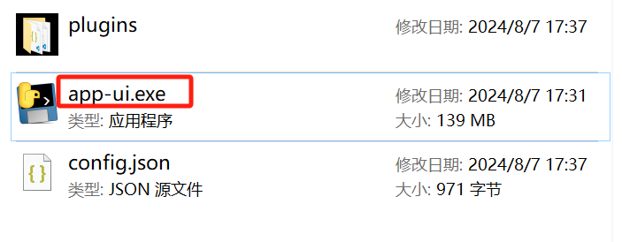
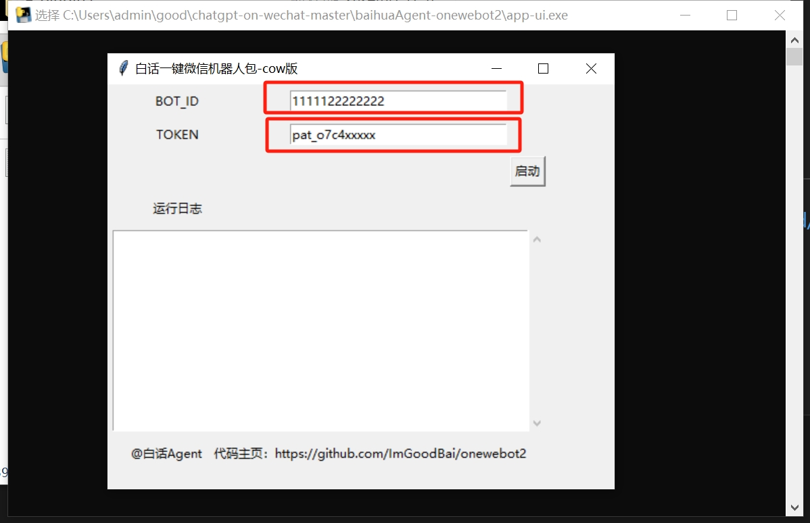
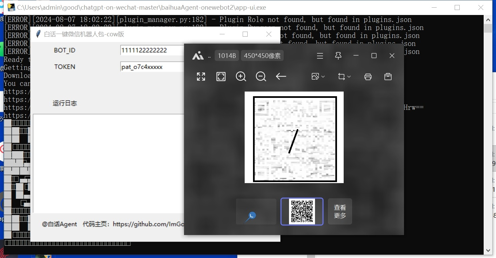
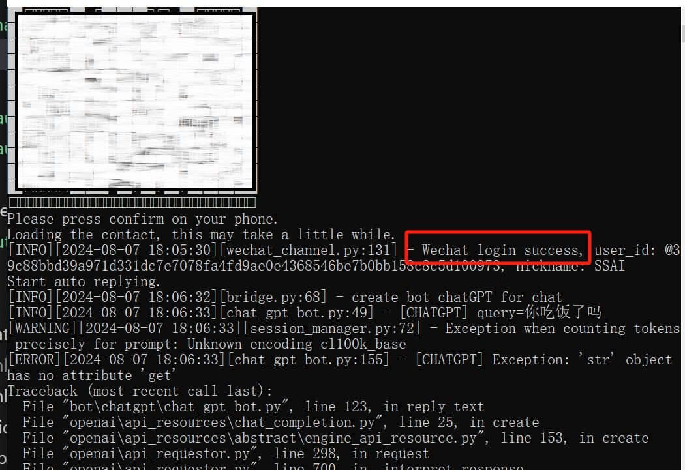

# 简介

> 基于 https://github.com/hanfangyuan4396/dify-on-wechat  二次打包，想要获得原始的体验请访问原项目。。

增加功能如下：

-  ✅   **coze API支持：** 主要增加了图形化界面方便配置coze botid和token；
-  ✅   **一键运行：** 已支持一键打包为exe文件，下载后可直接使用，无需再配置python运行环境;
-  ✅   **只支持windows：** 只在windows11上测试过没问题。

# 四步开启coze+微信机器人聊天
### 第一步：
进入release或者直接点下面地址下载一键包:
https://github.com/ImGoodBai/onewebot2/releases/download/02/onewebot2.zip
### 第二步：
解压zip包后，双击运行app-ui.exe

 

### 第三步：
在输入框中填入coze平台的botid和token后，点击运行；（需提前在coze.cn注册并配置后bot获取id和token）

### 第四步：
用微信（有封号风险，建议小号测试）扫描登陆，此时手机微信顶部会显示 *Web微信已登录* 字样

 

### 现在
如果看到类似下面信息，说明配置完成，开始微信对话体验AI聊天吧。

## 声明

1. 本项目遵循 [MIT开源协议](/LICENSE)，仅用于技术研究和学习，使用本项目时需遵守所在地法律法规、相关政策以及企业章程，禁止用于任何违法或侵犯他人权益的行为
2. 境内使用该项目时，请使用国内厂商的大模型服务，并进行必要的内容安全审核及过滤
3. 本项目主要接入协同办公平台，推荐使用公众号、企微自建应用、钉钉、飞书等接入通道，其他通道为历史产物已不维护
4. 任何个人、团队和企业，无论以何种方式使用该项目、对何对象提供服务，所产生的一切后果，本项目均不承担任何责任

